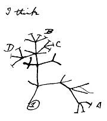

# Nimodovenidos sean todxs a teleclases de Sistemática 2020 coronavíricas

Copien y tengan a la mano esta página [de GitHub](https://hernanvm.github.io/Sistematica2020/) donde mantendremos comunicados, archivos y tareas para la clase. Aquí tenemos el calendario con el [temario](http://www.fciencias.unam.mx/docencia/horarios/presentacion/310487) y las fechas de examen 


## Para empezar, nos veremos en Zoom.us y necesitan instalar los siguentes programas

**R** (programa estadístico), **Rstudio** (manejador de R para hacerlo sencillo) y **Sublime3** (editor de texto pro)


### Salón virtual
[CUAED Zoom Sistematica2020 nuevo](https://cuaed-unam.zoom.us/j/944182947)

### Programas a instalar (seleccionen la versión que corresponda a su sistema Windows, Mac, Linux)

1. [R](https://cran.r-project.org/)
2. [Rstudio](https://rstudio.com/products/rstudio/download/#download) 
3. [Sublime3](https://www.sublimetext.com/3)
4. [PAUP](http://phylosolutions.com/paup-test/)
5. [FigTree](https://github.com/rambaut/figtree/releases)
6. [MrBayes](http://nbisweden.github.io/MrBayes/download.html)

### Herramientas bioinformáticas en línea

1. [GENBANK](https://www.ncbi.nlm.nih.gov/genbank/)
2. [MAFFT alineamientos](https://www.ebi.ac.uk/Tools/msa/mafft/)
3. [ML en IQTree](http://iqtree.cibiv.univie.ac.at)


## Notas, código de R, presentaciones, y ejercicios/tareas para la clase
- [Ejercicios y Tareas](https://github.com/HernanVM/Sistematica2020/tree/R/Ejercicios)
- [Código R](https://github.com/HernanVM/Sistematica2020/blob/R/Rcode/)
- [Presentaciones](https://github.com/HernanVM/Sistematica2020/tree/R/Presentaciones)
- [Lecturas](https://github.com/HernanVM/Sistematica2020/tree/R/Lecturas)


### Mantendremos notificaciones de cuándo regresamos a clases presenciales
La Facultad de Ciencias tiene un sitio del COVID19 [con preguntas frecuentes](https://sites.google.com/ciencias.unam.mx/covid19-fc/faq?authuser=0)

Recuerden revisar el [nuevo sitio UNAM sobre el COVID19](https://covid19comisionunam.unamglobal.com), las noticias en la sección de avisos de la [Facultad de Ciencias](http://www.fciencias.unam.mx/comunicacion/noticias), y en Twitter con el **#Sistematica2020**

### Contacto
```hernan (at) ib.unam.mx reemplazar (at) con @```

